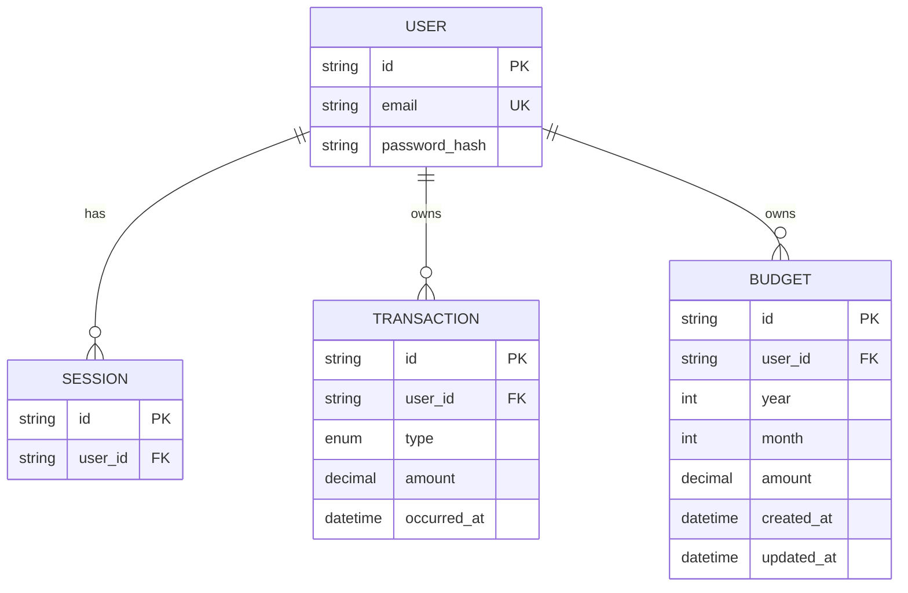

# ERD Expense Tracker — Fase 2

ERD ini menambah `Budget` pada [ERD fase 1](erd.md). Tabel `User`, `Session`, dan `Transaction` tetap dipakai dengan struktur lama; hanya `User` mendapat relasi baru ke `Budget`. Migration dilakukan pada database proyek yang sama tanpa menghapus data lama.

## Entitas baru
`Budget(id PK, userId FK, year Int, month Int, amount Decimal(14,2), createdAt, updatedAt)`.

- `User 1 — 0..N Budget`, setiap budget tepat memiliki satu user; penghapusan user menghapus budget terkait (`onDelete: Cascade`).
- `UNIQUE(userId, year, month)` menjamin satu budget per user per bulan.
- `year`, `month` (1–12), dan nominal positif hingga dua digit desimal divalidasi dengan Zod di server. `amount` tidak boleh melampaui kapasitas `Decimal(14,2)`.
- Pengeluaran, sisa, persentase, dan status tidak disimpan: agregasikan `Transaction` milik user bertipe `EXPENSE` dengan `occurredAt` dalam bulan Asia/Jakarta yang dipilih.

Kontrak implementasi dan otorisasi ada di [SRS fase 2](srs-phase-2.md). Indeks unik `(userId, year, month)` juga melayani query budget per pemilik dan bulan; indeks `Transaction(userId, occurredAt)` dari fase 1 tetap dipakai untuk query pengeluaran bulanan.
