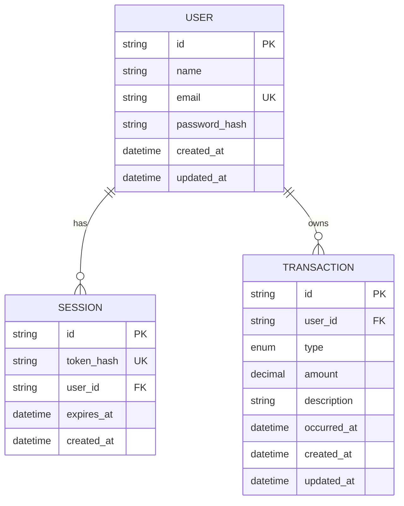

# ERD Expense Tracker

## Entitas
- **User:** identitas akun dan hash password.
- **Session:** session server-side yang terkait ke user.
- **Transaction:** catatan pemasukan/pengeluaran milik user.

## Atribut dan Kunci
`User(id PK, name, email UNIQUE, passwordHash, createdAt, updatedAt)`.
`Session(id PK, tokenHash UNIQUE, userId FK, expiresAt, createdAt)`.
`Transaction(id PK, userId FK, type, amount Decimal(14,2), description, occurredAt, createdAt, updatedAt)`.

## Relasi
Satu `User` memiliki nol atau banyak `Session` dan `Transaction`. Setiap session/transaksi tepat memiliki satu user. Penghapusan user menghapus data terkait melalui cascade.

## Constraints
Email dan token hash unik. Nominal divalidasi positif di server. Index tersedia untuk owner, tanggal, tipe, dan session expiry.

## Diagram

